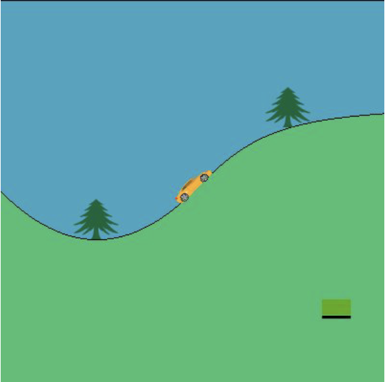

# INFO8003-1: Optimal Decision Making for Complex Problems
## Project 1: Reinforcement Learning in a Discrete Domain
### Authors: Romain LAMBERMONT, Arthur LOUIS

This project is part of the course of Optimal Decision Making for Complex Problems at the University of Liège. The course is given by Prof. Damien Ernst with the help of his teaching assistants Arthur Louette and Bardhyl Miftari. The goal of this project is to implement the car on the hill problem in a continuous domain and to solve it using reinforcement learning algorithms.

    
    
<em>Domain used during this project.</em>

### Sections
- Section 1: Implementation of the Domain [section1.py](./code/section1.py)
- Section 2: Expected Return of a Policy in a Continuous Domain [section2.py](./code/section2.py)
- Section 3: Visualization [section3.py](./code/section3.py)
- Section 4: Fitted-Q Iteration [section4.py](./code/section4.py)